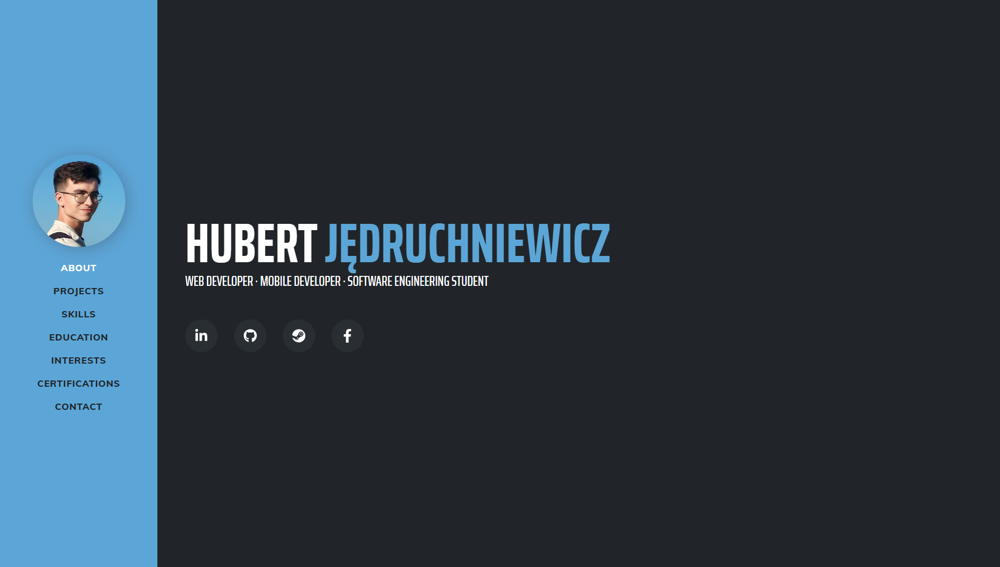
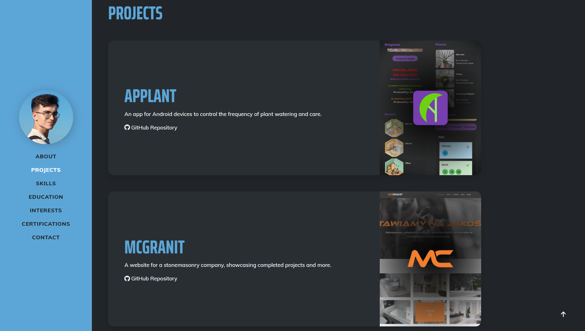
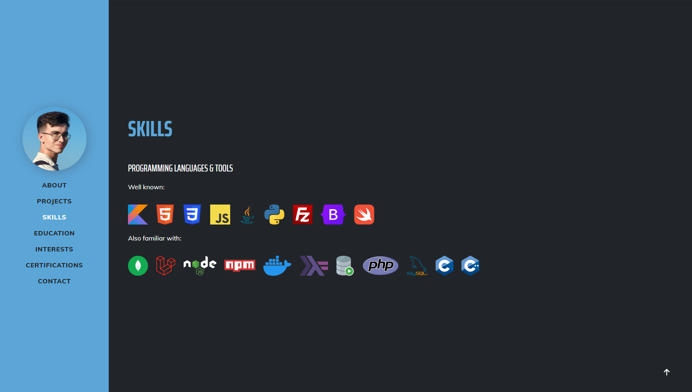
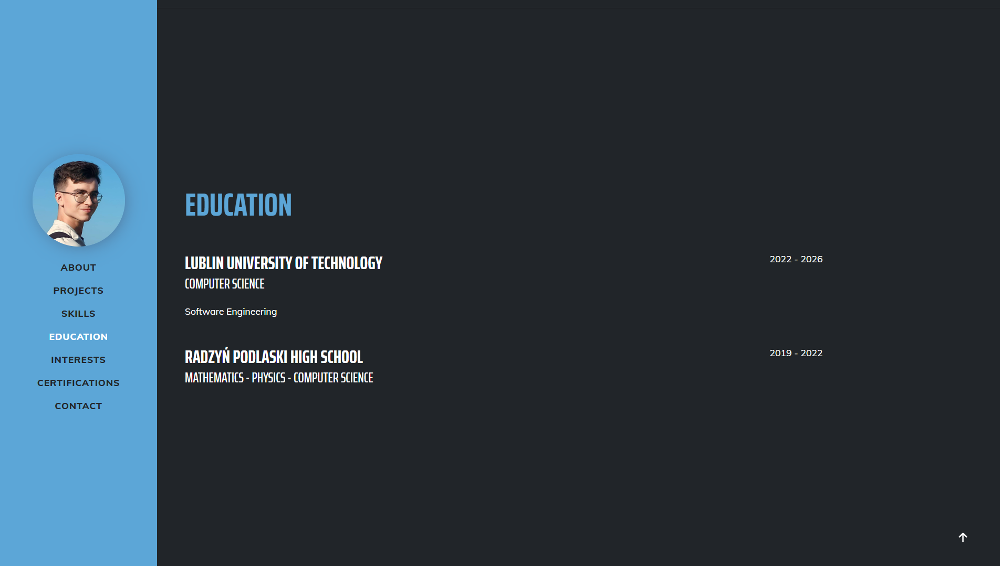
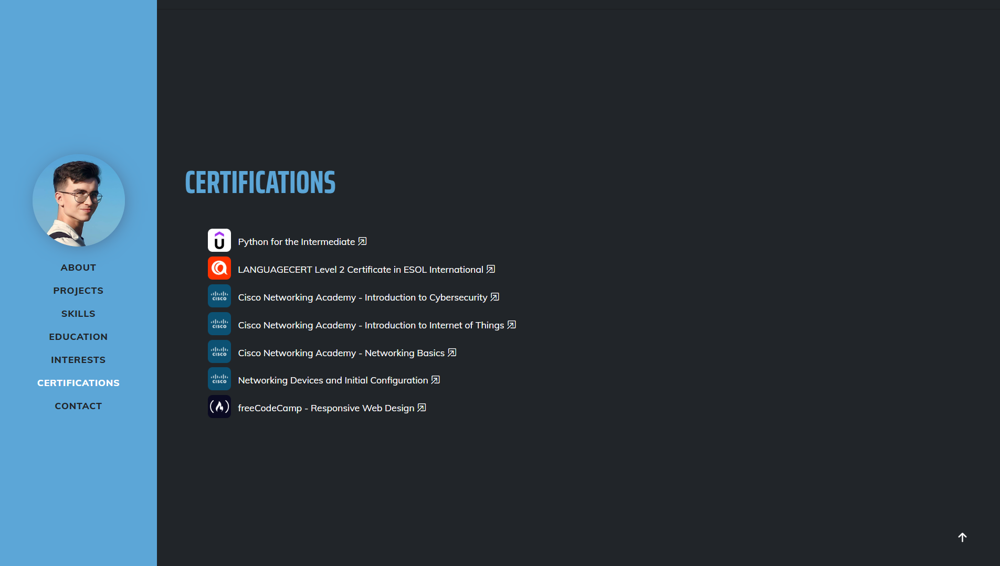
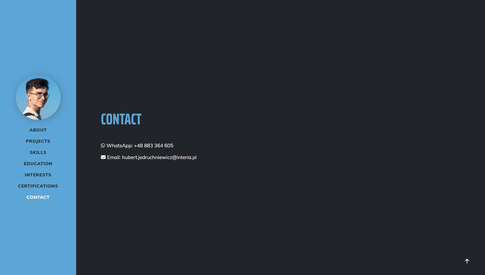
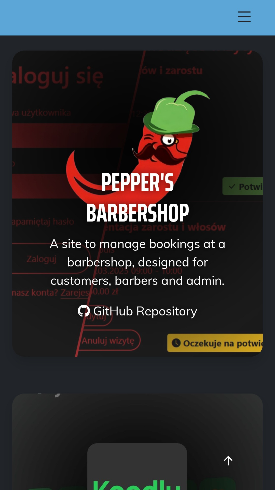
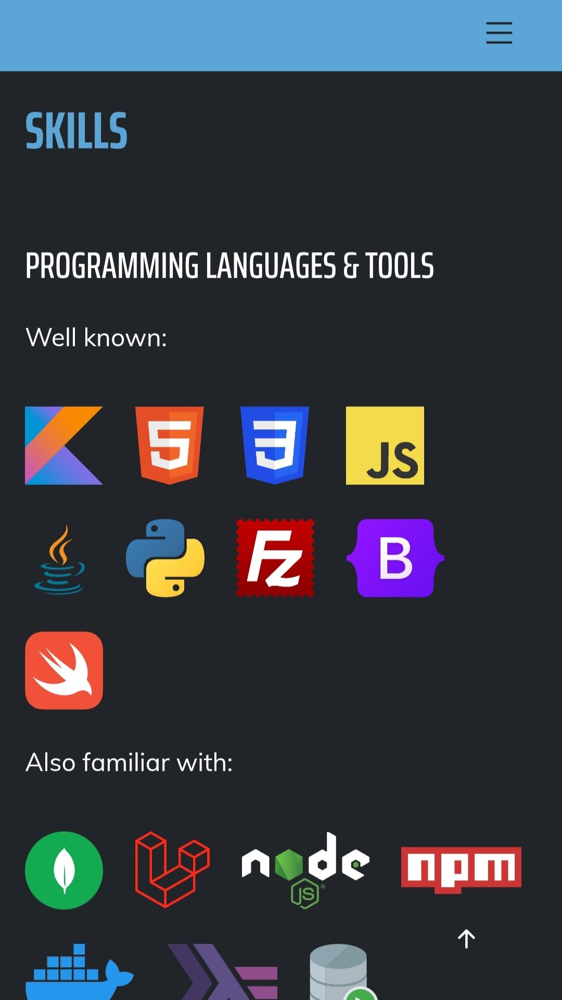

# My Portfolio Website

## Table of Contents
- 🚀 [Project Overview](#project-overview)
- ✨ [Features](#features)
- 💻 [Technologies](#technologies)
- 📋 [Requirements](#requirements)
- 🛠️ [Setup Instructions](#setup-instructions)
- 📸 [Screenshots](#screenshots)

## Project Overview
A site made to gather all projects and certifications in one place and easily access them. 
> [!NOTE]  
> The website is available in English language version!

## Features
- 🃏 Projects displayed using cards, with brief descriptions
- 🛠️ Skills described using language and tool icons
- 🎓 Certificates with links to authentication documents
- 📱 Full responsiveness

## Technologies

**Frontend:**
- Bootstrap
- HTML
- JavaScript

## Requirements
Software versions used for development:
- Bootstrap 5.0
> [!WARNING]  
> Compatibility with earlier versions has not been tested.

## Setup Instructions
1. Download `myWeb` folder.
2. Unzip project and open the `index.html` file.

## Screenshots

  
  
  
  
  
  

### Mobile Device

 
